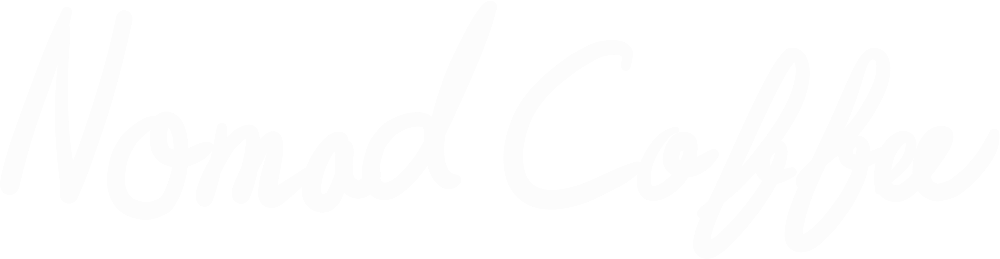

# nomadcoffee-native



## Day22-AppLoading(1d)

```
✅ Create a React Native project using expo-cli
✅ Write the code to preload fonts and images.
✅ Preload Ionicons
```

## Day23-Quiz about Expo(1d)

## Day24-Navigation!(3d)

```
✅ Make a Tab navigation for the app (no need to log in)
✅ The Tabs should be: home, search and profile
✅ Set up Apollo Client (with Authentication logic) to be able to log the user in.
✅ When the user goes to profile the user should see a login form.
✅ After the user logs in, show the profile of the user.
🎁 Implement a Profile component reusable for both of My and Other's profile
🎁 Implement dismissible keyboard
🎁 Hand written logo
```

## Day29-Home Tab!(3d)

```
✅ The Home tab should show all the coffee shops in your Database.
✅ Infinite Scroll
✅ Pull to Refresh
✅ The Coffee Shop component should display the name, photos and categories.
🎁 OffsetPagination for subfield manually
🎁 Display address by Google reverse geocode API
```

## Day32-Search Tab!(2d)

```
✅ make the Search tab.
✅ The Search tab should allow us to search for a Coffee Shop, using the title or the category!
🎁 Convertable button for searchType: "title" | "category"
🎁 Search tab with pagination
🎁 Use cache.evict to implement both offsetLimitPagination and refetch with searching again
```
